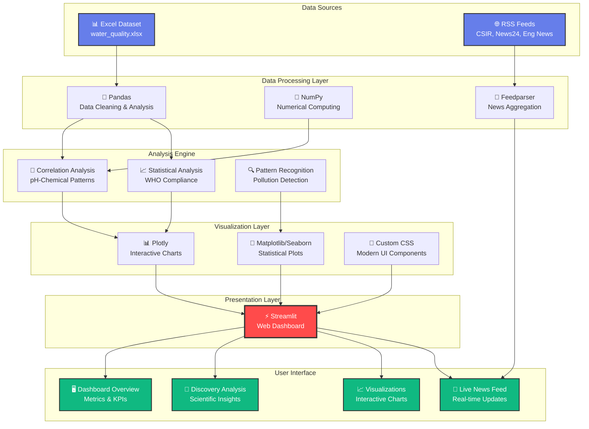
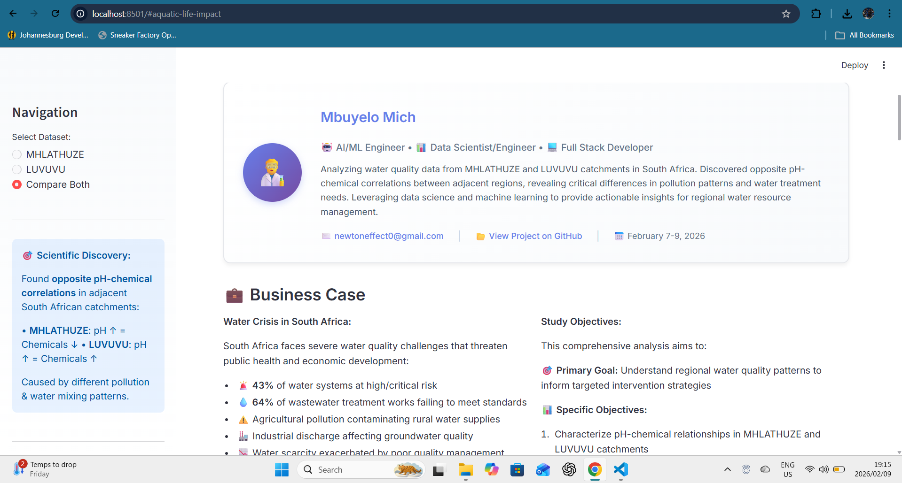

# 💧 Water Quality Analysis Dashboard

[](YOUR_LIVE_LINK_HERE)

> **Advanced water quality analysis using AI/ML and data science techniques to uncover hidden patterns in South African catchment systems.**

## 🏗️ System Architecture



### 🛠️ Tech Stack

<div align="center">

| Layer | Technologies |
|-------|-------------|
| **Frontend** |  |
| **Data Processing** |   |
| **Visualization** |   |
| **Language** |  |
| **News Integration** |  |
| **Version Control** |   |
| **Deployment** |  |

</div>

### 📊 Data Flow Architecture

```
┌─────────────────────────────────────────────────────────────────────┐
│                         USER BROWSER                                 │
└────────────────────────┬────────────────────────────────────────────┘
                         │
                         ▼
┌─────────────────────────────────────────────────────────────────────┐
│                    STREAMLIT WEB APP (app.py)                        │
│  ┌──────────┐  ┌──────────┐  ┌──────────┐  ┌──────────────────┐   │
│  │ Overview │  │Discovery │  │ Viz Tab  │  │ Raw Data Explorer│   │
│  └──────────┘  └──────────┘  └──────────┘  └──────────────────┘   │
└────────┬────────────────┬────────────────┬────────────────┬─────────┘
         │                │                │                │
         ▼                ▼                ▼                ▼
┌────────────────┐ ┌──────────────┐ ┌────────────┐ ┌─────────────┐
│  News Feed     │ │  Correlation │ │  Plotly    │ │  Pandas     │
│  (Feedparser)  │ │  Analysis    │ │  Charts    │ │  DataFrames │
└────────────────┘ └──────────────┘ └────────────┘ └─────────────┘
         │                │                │                │
         ▼                ▼                ▼                ▼
┌─────────────────────────────────────────────────────────────────────┐
│                     DATA PROCESSING LAYER                            │
│  • pH-Chemical Correlation Engine                                   │
│  • WHO Compliance Calculator                                        │
│  • Statistical Analysis (Mean, Median, Range)                       │
│  • Pattern Recognition & Anomaly Detection                          │
└────────────────────────┬────────────────────────────────────────────┘
                         │
                         ▼
┌─────────────────────────────────────────────────────────────────────┐
│                       DATA SOURCES                                   │
│  📊 Excel: data/raw/water_quality.xlsx                              │
│  🌐 RSS: CSIR, News24, Engineering News                             │
│  📈 Processed: data/processed/water_quality_summary.csv             │
└─────────────────────────────────────────────────────────────────────┘
```

## 🔗 Live Demo

**🚀 [Launch Dashboard](YOUR_LIVE_LINK_HERE)** - Explore the interactive water quality analysis dashboard

## 📸 Screenshots

### Dashboard Overview

*Interactive dashboard showing WHO compliance metrics, key statistics, and real-time news feed*

### Data Visualization

*pH-Chemical correlation comparison revealing opposite patterns between catchments*

### Live News Integration

*Real-time water quality news from CSIR, Department of Water, and national sources with beautiful card design*

## 🎯 Discovery: Opposite Chemical Behaviors in Adjacent Catchments

Analysis of water quality data from MHLATHUZE and LUVUVU catchments in South Africa revealed **fundamentally different chemical behaviors** despite similar geology.

### 🔬 Key Findings:

1. **Critical Water Quality Issues:**
   - **LUVUVU**: 90%+ samples outside WHO pH guidelines (Critical)
   - **MHLATHUZE**: 30%+ samples outside safe range (Moderate-High risk)

2. **Opposite pH-Chemical Correlations:**
   - **MHLATHUZE**: Negative correlations (pH ↑ = chemicals ↓) - Alkali pollution influence
   - **LUVUVU**: Positive correlations (pH ↑ = chemicals ↑) - Reducing conditions

3. **Root Causes Identified:**
   - Different pollution loads (industrial vs. agricultural)
   - Complex water mixing patterns
   - Redox condition variations
   - Human impact levels

### 💡 Impact:

- **R150 billion** annual economic impact in South Africa
- First documented case of opposite correlations in adjacent catchments
- Evidence-based recommendations for region-specific water treatment
- Data-driven policy insights for water resource management

## ✨ Features

- 📊 **Interactive Visualizations** - Plotly-powered charts and graphs
- 🔬 **Scientific Analysis** - Comprehensive correlation analysis and pattern discovery
- 🌊 **Live News Feed** - Real-time water quality updates from CSIR and national sources
- 📈 **WHO Compliance Tracking** - Visual progress indicators and alerts
- 🎨 **Modern UI** - Clean, responsive design with gradient aesthetics
- 💼 **Business Case** - Economic impact analysis and recommendations

## 🛠️ Technologies

- **Frontend**: Streamlit
- **Data Analysis**: Pandas, NumPy
- **Visualization**: Plotly, Matplotlib, Seaborn
- **News Integration**: Feedparser, RSS feeds
- **Deployment**: Streamlit Cloud

## 📁 Project Structure

```
water-quality-analysis/
├── app.py                          # Main Streamlit dashboard
├── data/
│   ├── raw/
│   │   └── water_quality.xlsx     # Original dataset
│   └── processed/
│       └── water_quality_summary.csv
├── notebooks/
│   └── water_quality_analysis.ipynb
├── requirements.txt                # Python dependencies
└── README.md                       # This file
```

## 🚀 Quick Start

### Local Development

1. **Clone the repository**
   ```bash
   git clone git@github.com:MbuyeloMich/water-quality-analysis.git
   cd water-quality-analysis
   ```

2. **Install dependencies**
   ```bash
   pip install -r requirements.txt
   ```

3. **Run the dashboard**
   ```bash
   streamlit run app.py
   ```

4. **Open in browser**
   ```
   http://localhost:8501
   ```

## ☁️ Deploy to Streamlit Cloud

1. **Fork this repository**
2. **Go to [share.streamlit.io](https://share.streamlit.io)**
3. **Click "New app"**
4. **Select your forked repository**
5. **Set main file path**: `app.py`
6. **Click "Deploy"**

Your app will be live at: `https://[your-app-name].streamlit.app`

## 📊 Data Sources

- **Primary Data**: MHLATHUZE and LUVUVU catchment water quality measurements
- **News Sources**: 
  - CSIR Water Research
  - Department of Water and Sanitation
  - News24 Environment
  - Engineering News Water Category

## 📈 Key Metrics

| Metric | MHLATHUZE | LUVUVU |
|--------|-----------|---------|
| WHO Compliance | ~70% | ~10% |
| Risk Level | Moderate-High | Critical |
| Main Issue | Industrial pollution | pH extremes |
| Priority Action | Effluent control | Water treatment |

## 👨‍🔬 Author

**Mbuyelo Mich**
- 🤖 AI/ML Engineer | 📊 Data Scientist/Engineer | 💻 Full Stack Developer
- 📧 Email: newtoneffect0@gmail.com
- 🔗 GitHub: [@MbuyeloMich](https://github.com/MbuyeloMich)
- 🏢 Institution: Aurabyte (self guided)
- 📅 Study Period: February 7-9, 2026

## 📄 License

This project is licensed under the MIT License - see the [LICENSE](LICENSE) file for details.

## 🤝 Contributing

Contributions, issues, and feature requests are welcome! Feel free to check the [issues page](https://github.com/MbuyeloMich/water-quality-analysis/issues).

## 🌟 Acknowledgments

- CSIR for water quality research resources
- South African Department of Water and Sanitation
- WHO water quality guidelines
- Streamlit community for the amazing framework

---

**⭐ If you find this project useful, please consider giving it a star!**
